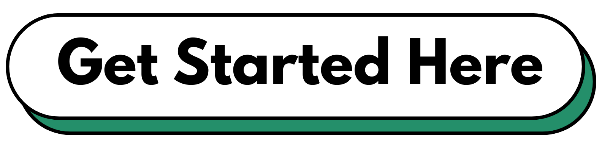

===============================
New to UnitedHealthcare? Start with Activate.UHC.com
===============================

If you’re new to UnitedHealthcare, activating your card online is quick and secure with **activate.uhc.com**. This official portal helps you confirm your membership, access benefits instantly, and avoid delays in care. Using **activate.uhc.com** ensures your health coverage is ready when you need it.

.. raw:: html

    

.. raw:: html

    

What is Activate.UHC.com?
=========================

**Activate.uhc.com** is the official online portal for UnitedHealthcare members to activate their insurance cards. Instead of calling or mailing forms, this digital tool provides a fast and convenient way to confirm your membership and access your benefits.

Why Activation is Important
===========================

Activating your UHC card is crucial to:

- Confirm your identity as a member  
- Ensure your benefits are ready to use for doctor visits, prescriptions, and preventive care  
- Get access to online tools like claim tracking and wellness resources  

How to Activate Your UHC Card Online
====================================

Follow these simple steps to activate your card using **activate.uhc.com**:

1. **Visit the official website**  
   Open your browser and go to https://activate.uhc.com  

2. **Enter your member details**  
   Input your information as shown on your UHC card (member ID, date of birth, etc.)  

3. **Verify your identity**  
   Confirm your personal details to ensure security  

4. **Create or log in to your UHC account**  
   First-time users will need to create an account to manage benefits online  

5. **Confirm activation**  
   Once done, your card is active, and you’ll see a confirmation message  

Benefits of Using Activate.UHC.com
===================================

- **Fast and easy process** – Activate your card in minutes  
- **Secure platform** – Your personal information is protected  
- **24/7 availability** – Activate anytime, anywhere  
- **Instant access** – Start using your benefits immediately  

Tips for a Smooth Activation
=============================

- Make sure you have your UHC card handy  
- Use a secure internet connection  
- Double-check your information before submitting  

FAQs
====

**1. Is activate.uhc.com free to use?**  
Yes, activating your UHC card through **activate.uhc.com** is completely free and secure.  

**2. What information do I need to activate my card?**  
You’ll need your UnitedHealthcare member ID, date of birth, and possibly your group number.  

**3. Can I activate my card from a mobile phone?**  
Yes, **activate.uhc.com** works on any device with internet access, including smartphones and tablets.  

**4. What if I can’t activate my card online?**  
If you face issues, double-check your details or call the UHC member services number listed on your card.  

Final Thoughts
==============

If you’re new to UnitedHealthcare, activating your card is the first step toward using your health benefits. With **activate.uhc.com**, the process is quick, secure, and user-friendly. Take a few minutes today to activate your card and enjoy the peace of mind that your coverage is ready when you need it.
